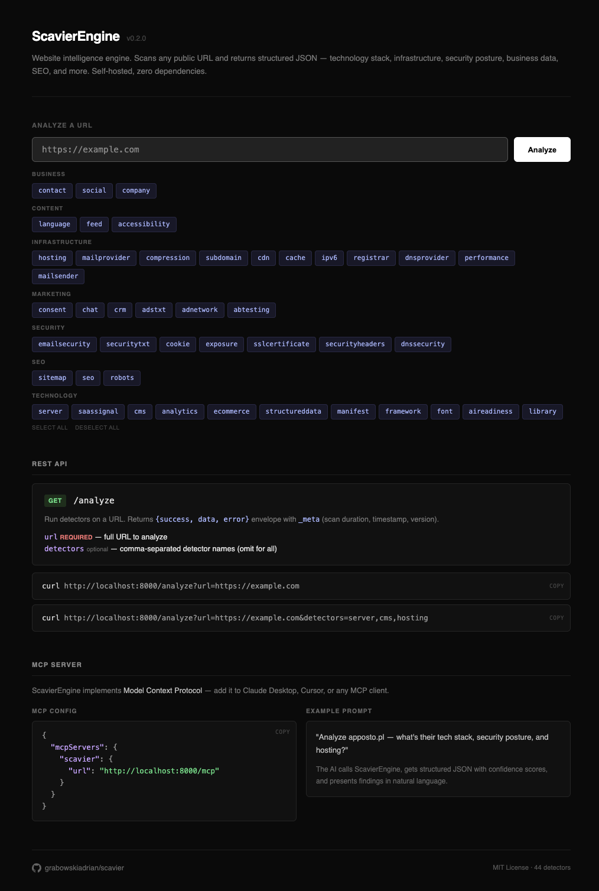

# Scavier

[](LICENSE)
[](https://www.php.net/)
[]()

Open-source **Website Intelligence Engine**. Analyzes any public URL and returns structured knowledge about its technology stack, infrastructure, security posture, business signals, and more. One API call. No API keys. Self-hosted.

**What it detects:** CMS, frameworks, libraries, analytics, hosting provider, CDN, DNS, SSL/TLS, security headers, email security, e-commerce platforms, payment providers, CRM, chat widgets, A/B testing tools, social profiles, company data, SEO health, AI readiness, and much more — **44 detectors** across 8 categories.



## Quick Start

### Docker (recommended)

```bash
git clone https://github.com/grabowskiadrian/scavier-engine-engine.git
cd scavier
docker compose up -d
```

Scavier is now running at `http://localhost:8000`.

### Manual

Requires PHP 8.3+ with `curl` and `dom` extensions. System tools: `dig`, `openssl`, `whois`.

```bash
git clone https://github.com/grabowskiadrian/scavier-engine.git
cd scavier
composer install
php -S localhost:8000 -t public
```

## Usage

### REST API

```bash
# All detectors
curl "http://localhost:8000/analyze?url=https://example.com"

# Specific detectors
curl "http://localhost:8000/analyze?url=https://example.com&detectors=cms,hosting,analytics"
```

Response:

```json
{
  "success": true,
  "url": "https://example.com",
  "data": {
    "technology": {
      "cms": {
        "value": "WordPress",
        "confidence": 0.95,
        "evidence": "Meta generator tag",
        "version": "6.4",
        "plugins": ["woocommerce", "yoast-seo"],
        "theme": "flavor"
      },
      "frameworks": [
        { "value": "React", "type": "frontend", "confidence": 0.85, "evidence": "Script src match" }
      ]
    },
    "infrastructure": {
      "hosting": { "value": "Hetzner", "confidence": 0.8, "evidence": "WHOIS ASN match" },
      "cdn": { "value": "Cloudflare", "confidence": 1, "evidence": "HTTP header: cf-ray" }
    },
    "security": {
      "headers": {
        "present": [
          { "header": "Strict-Transport-Security", "value": "max-age=31536000; includeSubDomains" }
        ],
        "missing": ["Content-Security-Policy", "Permissions-Policy"]
      }
    },
    "audit": {
      "security_score": { "score": 0.6, "grade": "C", "present_count": 6, "total_count": 10 },
      "seo_score": { "score": 0.82, "passed": 9, "total": 11 }
    },
    "_meta": {
      "scan_duration": 14.2,
      "timestamp": "2025-01-15T10:30:00+00:00",
      "engine_version": "0.2.0",
      "detectors_run": ["cms", "hosting", "analytics"],
      "tags": ["Cloudflare", "Google Analytics", "React", "WordPress"]
    }
  }
}
```

Open `http://localhost:8000` in a browser for interactive docs with a detector picker UI.

### MCP Server

Scavier implements [Model Context Protocol](https://modelcontextprotocol.io) — add it to Claude Desktop, Cursor, or any MCP client:

```json
{
  "mcpServers": {
    "scavier": {
      "url": "http://localhost:8000/mcp"
    }
  }
}
```

Then ask your AI: *"Analyze example.com and tell me what tech stack they use"*

### PHP API

```php
use Scavier\Engine\Scavier;

$scavier = new Scavier();
$result = $scavier->analyze('https://example.com');

if ($result['success']) {
    $data = $result['data'];
    // $data['technology']['cms']['value'] => 'WordPress'
}
```

## Detectors

44 detectors organized in 8 categories. Use short names with the `detectors` query parameter.

### Technology (11)

| Short name | Description |
|------------|-------------|
| `server` | Web server software and runtime (nginx, Apache, PHP version) |
| `cms` | CMS with version, plugins, theme (WordPress, Drupal, Joomla, Wix, ...) |
| `framework` | Frontend and backend frameworks (React, Vue, Next.js, Laravel, Django, ...) |
| `library` | JS/CSS libraries with versions (jQuery, Bootstrap, HTMX, D3.js, ...) |
| `analytics` | Analytics tools and tracking IDs (GA4, GTM, Hotjar, Mixpanel, ...) |
| `ecommerce` | E-commerce platform and 14 payment processors |
| `font` | Font services and families (Google Fonts, Adobe Fonts, Bunny Fonts) |
| `structureddata` | JSON-LD structured data types |
| `manifest` | PWA manifest detection |
| `aireadiness` | AI readiness: llms.txt, MCP server, OpenAPI docs, AI crawler policy |
| `saassignal` | Strategic SaaS signals: auth, search, push, monitoring, feature flags, headless CMS |

### Infrastructure (11)

| Short name | Description |
|------------|-------------|
| `hosting` | Hosting provider via headers, CNAME, IP, ASN (30+ providers) |
| `cdn` | Content delivery network (Cloudflare, Fastly, CloudFront, Akamai, ...) |
| `dnsprovider` | DNS hosting provider (16 providers) |
| `mailprovider` | Mailbox hosting via MX records (Google Workspace, Microsoft 365, ...) |
| `mailsender` | Email sending services from SPF (Mailchimp, SendGrid, ...) |
| `registrar` | Domain registration, registrar, age, WHOIS data |
| `subdomain` | Subdomain discovery via TLS SAN, crt.sh, DNS brute force |
| `performance` | Response timing, TTFB grading, page weight, HTTP version |
| `compression` | HTTP compression (gzip, brotli) |
| `cache` | Caching headers analysis |
| `ipv6` | IPv4/IPv6 dual-stack support |

### Security (7)

| Short name | Description |
|------------|-------------|
| `securityheaders` | Security headers audit with A-F grading (HSTS, CSP, X-Frame-Options, ...) |
| `sslcertificate` | SSL certificate, TLS config, OCSP stapling, issuer identification |
| `cookie` | Cookie analysis and tracker identification |
| `emailsecurity` | Email authentication (SPF, DMARC) |
| `dnssecurity` | DNS security (DNSSEC, CAA, DANE) |
| `exposure` | Sensitive file exposure (.env, .git, DNS zone transfer) |
| `securitytxt` | security.txt vulnerability disclosure file |

### Business (3)

| Short name | Description |
|------------|-------------|
| `company` | Company identity, registration numbers (NIP, REGON, KRS, VAT) |
| `contact` | Contact info from multi-page scan (email, phone, address) |
| `social` | Social media profiles (8 platforms) |

### Marketing (6)

| Short name | Description |
|------------|-------------|
| `crm` | CRM and marketing automation (HubSpot, Salesforce, Marketo, ...) |
| `adnetwork` | Advertising networks (AdSense, Ad Manager, Taboola, ...) |
| `adstxt` | ads.txt file and programmatic ad exchanges |
| `abtesting` | A/B testing tools (Optimizely, VWO, LaunchDarkly, ...) |
| `chat` | Live chat widgets (Intercom, Drift, Zendesk, Crisp, ...) |
| `consent` | Cookie consent management (Cookiebot, OneTrust, ...) |

### SEO (3)

| Short name | Description |
|------------|-------------|
| `robots` | robots.txt analysis and AI bot blocking detection |
| `sitemap` | sitemap.xml detection and structure |
| `seo` | SEO audit: meta tags, Open Graph, canonical, structured data (11 checks) |

### Content (3)

| Short name | Description |
|------------|-------------|
| `language` | Website language and multilingual support |
| `accessibility` | Accessibility signals and overlay tool detection |
| `feed` | RSS/Atom feed detection |

## Architecture

```
URL -> Target (SSRF check) -> Collectors (fetch data) -> Context -> Detectors (extract knowledge) -> JSON
```

- **11 Collectors** fetch raw data: HTTP response, HTML DOM, DNS records, TLS certificate, WHOIS, RDAP, Certificate Transparency, subdomain brute-force, zone transfer testing
- **44 Detectors** analyze collected data and extract structured knowledge with confidence scores
- **Context** is a shared typed data store between collectors and detectors
- **Auto-discovery** — drop a PHP class in the right directory, it's available instantly
- **Dependency resolution** — topological sort ensures correct execution order

Full architecture documentation: [doc/architecture.md](doc/architecture.md)

## Output format

Every detected fact carries:

| Field | Description |
|-------|-------------|
| `value` | The detected technology/service name |
| `confidence` | `0.0` - `1.0` — how certain the detection is |
| `evidence` | What signal triggered the detection |

Confidence is calibrated by evidence type: HTTP headers = 1.0, meta generator = 0.95, script URL = 0.9, inline pattern = 0.85, cookies = 0.8, HTML patterns = 0.7, text patterns = 0.6.

The `_meta.tags` array provides a flat, deduplicated list of all technology/service names found — a quick summary without traversing the full result tree.

The `audit` section aggregates cross-detector scores: security grade (A-F), SEO score, SSL issues, and exposure alerts.

## Extending

### Adding a detector

Drop a PHP class into any subdirectory of `src/Detector/` — it's auto-discovered and available via API and MCP instantly.

```php
<?php

namespace Scavier\Detector\Technology;

use Scavier\Collector\HtmlCollector;
use Scavier\Collector\Data\HtmlData;
use Scavier\Engine\Context;
use Scavier\Engine\Contract\Detector;

class MyDetector extends Detector
{
    public static function dependencies(): array
    {
        return [HtmlCollector::class];
    }

    public function detect(Context $context): ?array
    {
        $html = $context->get(HtmlData::class);

        if ($html->hasScriptMatching('/my-tool\.js/')) {
            return [
                'technology' => [
                    'my_tool' => [
                        'value' => 'MyTool',
                        'confidence' => 0.9,
                        'evidence' => 'Script src match',
                    ],
                ],
                '_tags' => ['MyTool'],
            ];
        }

        return null;
    }
}
```

### Adding a collector

Same pattern — drop a class into `src/Collector/`:

```php
<?php

namespace Scavier\Collector;

use Scavier\Engine\Context;
use Scavier\Engine\Contract\Collector;
use Scavier\Engine\Target;

class MyCollector extends Collector
{
    public static function dependencies(): array
    {
        return []; // other collectors this one depends on
    }

    public function execute(Target $target, Context $context): void
    {
        // Fetch data, store in context via $context->set(new MyData(...))
    }
}
```

## Documentation

- [Architecture](doc/architecture.md) — pipeline, components, output structure, security model
- [Collectors reference](doc/collectors.md) — all 11 collectors with fields and implementation notes
- [Detectors reference](doc/detectors.md) — all 44 detectors with detection logic and output keys

## Development

```bash
composer install        # install dependencies (including dev)
composer test           # run PHPUnit tests (250 tests, 541 assertions)
php -S localhost:8000 -t public   # start dev server
```

## Contributing

Contributions are welcome. See [CONTRIBUTING.md](CONTRIBUTING.md) for details and [Code of Conduct](CODE_OF_CONDUCT.md).

## License

[MIT](LICENSE)
